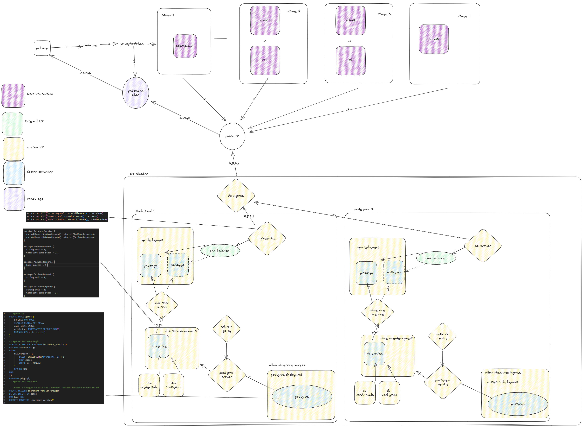

## Yatzy API
This Yatzy engine is a buffed implementation of a simple game, function wise its simple and contains three endpoints:

- CreateGame
- RollDice
- SubmitChoice

The API is built using golang and grpc, it uses a postgres database for storing data. It's deployed using kubernetes and docker.
It's built with a microservice architecture in mind, and is designed to be scalable. 

The API is intended to scale horizontally by running multiple instances of api-deployment

For details look at archiectural diagram under [Architecture](#architecture-hld)

## Table of Contents
- [Yatzy API](#yatzy-api)
- [Table of Contents](#table-of-contents)
- [Future development](#Backlog)
- [Prerequisites](#prerequisites)
- [Basic Usage](#basic-usage)
- [Basic usage local (no kubernetes)](#basic-usage-local-no-kubernetes)
- [Running Tests](#running-tests)
- [Docker hub](#docker-hub)

## Backlog
- Websocket for online play
- Leaderboard
- Horizontal scaling for db service


## Architecture (HLD)



## Prerequisites

* Docker CLI
* Minikube
* Protoc


## Basic Usage Docker

```bash
docker build -t yatzy-api .
```

```bash
docker run -p 8080:8080 yatzy-api
```

## Basic usage local (no kubernetes)
Checklist:
- [ ] Docker
- [ ] Go to cmd/dbservice/dev and run docker-compose up
- [ ] go to localhost:5050 (admin@admin.com / root) and add the db server
- [ ] go to cmd/dbservice and run go run main.go
- [ ] go to cmd/api and run go run main.go
- [ ] Test api via localhost:8080

## Running Tests
To run tests, navigate to the test directory.

Then run:  
```bash
go test -v
```

## Docker hub
For this project we use docker hub for our container registry, to push to docker hub you must first login using:

```bash
docker login
```

Then you can push to docker hub using:

```bash
docker push <username>/<repo>:<tag>
```


## Pushing to docker hub and deploying to kubernetes

### Docker hub


Build docker image for kubernetes: 
1. docker build -t yatzy-api:v1(+1) . 
Tag local image
2. docker tag yatzy-api:v1 leebadal1/yatzy-api:v1(+1)
Push image to intenal registry
3. docker push leebadal1/yatzy-api:tagname
Create kubernetes deployment (see below)
4. 
spec:
  containers:
    - name: api-container
      image: leebadal1/yatzy-api:v1.10(+1)
  imagePullSecrets:
        - name: regcred


### Kubernetes
Since the repo is private you must create a secret:
```bash	
kubectl create secret docker-registry regcred --docker-server=https://index.docker.io/v1/ --docker-username=leebadal1 --docker-password=<your-pword> --docker-email=<your-email>
```

Once you have pushed to docker hub and updated deployment, apply all api-*.yaml's with 
```bash	
kubectl apply -f <filename>
```

Now your service should be running, to get the url for the api-service run:
```bash
minikube service api-service --url
```

### First time running database
For running the database for the first time, you will need to generate a user/password for psql:
In this case we choose to store the secrets in the k8 cluster using the database-creds.yaml
As this contains sensitive data the repo contains a database-credentials-template.yaml in which you can add you username/password for the service.

Enter a username/password and deploy the secret to using kubectl:

```bash	
kubectl apply -f database-credentials.yaml
```

### 

1. kubectl apply -f api-deployment.yaml 
2. kubectl apply -f api-ingress.yaml
3. kubectl apply -f api-service.yaml
4. kubectl scale deployment api-deployment --replicas=3  (optional)
5. kubectl port-forward svc/api-service 8080:80 ##
6. CLEANUP 
kubectl delete deployment api-deployment
kubectl delete ingress api-ingress
kubectl delete service api-service

## Useful commands

```bash	
kubectl get deployment
```

```bash
kubectl get pods
```

```bash
kubectl get services
```

```bash
kubectl get ingress
```
Describe a resource
```bash
kubectl describe <resource> <resource-name>
```

View logs of pod
```bash
kubectl logs <pod-name>
```


### Making changes and redeploying to minikube
1. Making changes to code
2. Build docker image
3. Push to docker hub
4. Update deployment with new image
5. Apply deployment to minikube


### Troubleshooting

If you intalled minikube as an elevated user, run elevated command prompts when running commands.

Sometimes, restarting Docker and Minikube can resolve various context-related issues:

Restart Docker Desktop.
Restart Minikube using minikube stop followed by minikube start.


### Finding URL for your service
```bash
minikube service <service-name> --url
```

(on windows terminal has to remain open, url will change on restart)

### Quick launch
1. Start Docker Desktop, use minikube context
2. Start minikube (minikube start)
3. Apply everything (see above)
4. Get the url for the service (see finding url for your service)


### Generating proto files
api2 contains proto files for now, to generate the go files run:
```bash	
protoc --go_out=. --go-grpc_out=. dbservice.proto
```

run this then move the files to cmd/dbservice

### cmd/dbservice
dbservice is the service that manages db interactions, it has a grpc interface, db actions and manages migrations of the db.
Migrations are manageed automatically.

To start the dev db run:
```bash
docker compose up 
```
Add -d if you want to run in detached mode


```bash
docker-compose down
```
If you would ever need to reset the db, you can run:
```bash
docker-compose down -v
```

Migrations follow the naming convention: YYYYMMDDHHIISS_migration_name.sql

#### PgAdmin
For dev, pgadmin is used to manage the db, it can be accessed at localhost:5050

The first time you need to add the db server, if you are using the docker-compose database the details are:

```json
  host/address: db
  port: 5432
  maintenance databse: postgres
  username: postgres
  password: root
```
  


