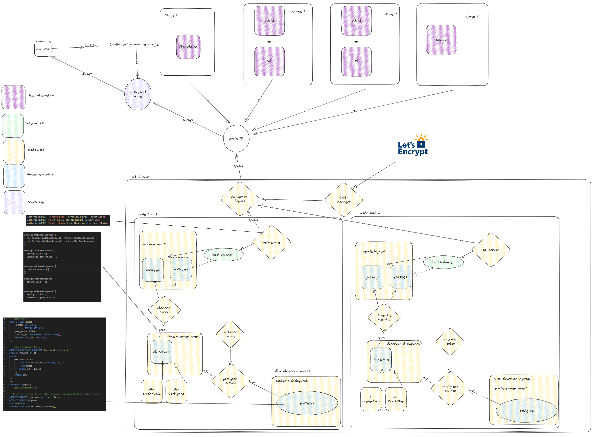

## Yatzy API
This Yatzy engine is a buffed implementation of a simple game, function wise its simple and contains three endpoints:

- CreateGame
- RollDice
- SubmitChoice

The API is built using golang and grpc, it uses a postgres database for storing data. It's deployed using kubernetes and docker.
It's built with a microservice architecture in mind, and is designed to be scalable. 

The API is intended to scale horizontally by running multiple instances of api-deployment

For details look at archiectural diagram under [Architecture](#architecture-hld)

There are three ways of using the API:
1. Locally (go run) + docker compose
2. Minikube + docker server
3. Digital Ocean Kubernetes Service

Specific instructions for each can be found under each section.

## Table of Contents
- [Yatzy API](#yatzy-api)
- [Table of Contents](#table-of-contents)
- [Backlog](#backlog)
- [Architecture (HLD)](#architecture-hld)
- [Development stack](#development-stack)
- [Local + docker compose](#local--docker-compose)
- [MiniKube + Docker server](#minikube--docker-server)
- [Digital Ocean Kubernetes Service](#digital-ocean-kubernetes-service)
- [Development & Debugging](#development--debugging)
  - [First time running database (minikube/digital ocean)](#first-time-running-database-minikubedigital-ocean)
  - [debug pod](#debug-pod)
  - [Generating proto files](#generating-proto-files)
  - [cmd/dbservice](#cmddbservice)
  - [PgAdmin](#pgadmin)
  - [Build and push api image](#build-and-push-api-image)
  - [Running Tests](#running-tests)
  - [Useful commands](#useful-commands)
- [Deployment](#deployment)
  - [Pushing a new version of the api /db service](#pushing-a-new-version-of-the-api--db-service)
  - [Applying all necessary yaml's & order](#applying-all-necessary-yamls--order)
  - [Docker hub](#docker-hub)


## Backlog
- Websocket for online play
- Leaderboard
- Horizontal scaling for db service


## Architecture (HLD)



## Development stack
* Docker CLI
* Minikube
* Protoc
* kubeadm 


## Local + docker compose
Checklist:
- [ ] Docker
- [ ] Go to cmd/dbservice/dev and run docker-compose up
- [ ] go to localhost:5050 (admin@admin.com / root) and add the db server
- [ ] go to cmd/dbservice and run go run main.go
- [ ] go to cmd/api and run go run main.go
- [ ] Test api via localhost:8080

## MiniKube + Docker server
Checklist:
- [ ] Docker
- [ ] Minikube
- [ ] kubectl

To run the api on minikube you will need to have minikube installed, and have a docker server running, use minikube as context and apply all the k8's yaml's.

Once you have all the deployments and services up expose the api by running:
```bash: 
minikube service api-service --url
```
Copy the URL and it will be accessible on port 8080.

Use minikube dashboard to view all resources

## Digital Ocean Kubernetes Service
Checklist:
- [ ] kubeadm
- [ ] doctl
- [ ] kubectl
- [ ] Digital Ocean Kubernetes cluster
- [ ] Nginx ingress controller
- [ ] Cert manager
- [ ] Two node pools 

For my configuration i used 2vCPU, 4GB memory 100GB disk

You will also have to modify do-ingress.yaml to use your own host.

To get started use this: https://docs.digitalocean.com/products/kubernetes/how-to/create-clusters/
Swap your default context to the digital ocean context & apply all yamls.

Besides all other configuration files you will also have to run a cert manager and ingress controller.

I recommend running the test-issuer.yaml to check so that cert-manager is working correctly. You can do this by running:
  
```bash
kubectl apply -f test-issuer.yaml
```
    
Then check the status of the certificate by running:
    
```bash
kubectl describe certificate cert-manager-test
```
After you've verified this you can delete the test-issuer.yaml by running:
```bash
kubectl delete -f test-issuer.yaml
```


I installed cert manager & nginx ingress using Digital ocean 1-click-apps.

Next we use issuer.yaml, certificate.yaml & do-ingress.yaml to configure the ingress controller.

Make sure to configure these for your own domain & update DNS records for your domain.

```bash
kubectl apply -f issuer.yaml
kubectl apply -f certificate.yaml
kubectl apply -f do-ingress.yaml
```


## Development & Debugging

### First time running database (minikube/digital ocean)
For running the database for the first time, you will need to generate a user/password for psql:
In this case we choose to store the secrets in the k8 cluster using the database-creds.yaml
As this contains sensitive data the repo contains a database-credentials-template.yaml in which you can add you username/password for the service.

Enter a username/password and deploy the secret to using kubectl:

```bash	
kubectl apply -f database-credentials.yaml
```

### debug pod
kubectl run -it --rm --restart=Never debug-pod --image=busybox -- /bin/sh

### Generating proto files
api2 contains proto files for now, to generate the go files run:
```bash	
protoc --go_out=. --go-grpc_out=. dbservice.proto
```

run this then move the files to cmd/dbservice

### cmd/dbservice
dbservice is the service that manages db interactions, it has a grpc interface, db actions and manages migrations of the db.
Migrations are manageed automatically.

To start the dev db run:
```bash
docker compose up 
```
Add -d if you want to run in detached mode


```bash
docker-compose down
```
If you would ever need to reset the db, you can run:
```bash
docker-compose down -v
```

Migrations follow the naming convention: YYYYMMDDHHIISS_migration_name.sql

To build the dbservice image run:
```bash
docker build -f dbservice.Dockerfile -t yatzy-dbservice:v1 .
```

docker tag yatzy-dbservice:v1 leebadal1/yatzy-dbservice:v1
docker push leebadal1/yatzy-dbservice:v1

### PgAdmin
For dev, pgadmin is used to manage the db, it can be accessed at localhost:5050

The first time you need to add the db server, if you are using the docker-compose database the details are:

```json
  host/address: db
  port: 5432
  maintenance databse: postgres
  username: postgres
  password: root
```


### Build and push api image
```bash	
docker build -f yatzy.Dockerfile -t yatzy-api:v2.06 .
docker tag yatzy-api:v2.06 leebadal1/yatzy-api:v2.06 
docker push leebadal1/yatzy-api:v2.06
```

### Running Tests
To run tests, navigate to the test directory.

Then run:  
```bash
go test -v
```
### Useful commands

```bash	
kubectl get deployment
```

```bash
kubectl get pods
```

```bash
kubectl get services
```

```bash
kubectl get ingress
```
Describe a resource
```bash
kubectl describe <resource> <resource-name>
```

View logs of pod
```bash
kubectl logs <pod-name>
```


## Deployment

### Pushing a new version of the api /db service

Build docker image:
1. docker build -t yatzy-api:v1(+1) . 
Tag local image
2. docker tag yatzy-api:{v2} leebadal1/yatzy-api:{v2}
Push image to intenal registry
3. docker push leebadal1/yatzy-api:tagname
Modify the k8 yaml version:
Example: api-deployment.yaml
4. 
spec:
  containers:
    - name: api-container
      image: leebadal1/yatzy-api:v1.10(+1)

Once you have pushed to docker hub and updated deployment, apply all api-*.yaml's with 
```bash	
kubectl apply -f <filename>
```
### Applying all necessary yaml's & order

To minikube/doks you will need to apply all the yaml's in the following order:

1. kubectl apply -f database-credentials.yaml
2. kubectl apply -f configmap.yaml
2. kubectl apply -f api-deployment.yaml 
3. kubectl apply -f api-service.yaml
4. kubectl apply -f postgres-deployment.yaml
5. kubectl apply -f postgres-service.yaml
6. kubectl apply -f dbservice-deployment.yaml
7. kubectl apply -f dbservice-service.yaml
8. kubectl apply -f network-policy.yaml

Remember to apply do-ingress.yaml for production.

### Docker hub
For this project we use docker hub for our container registry, to push to docker hub you must first login using:

```bash
docker login
```

Then you can push to docker hub using:

```bash
docker push <username>/<repo>:<tag>
```


